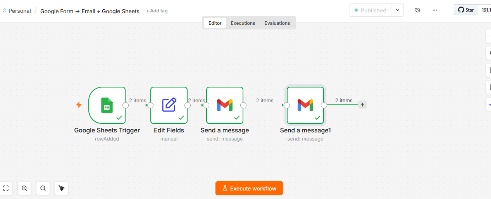

# 📝 Google Form → Email + Google Sheets — n8n Automation

## What This Does

I built this because I kept seeing the same problem.

Business owners had Google Forms on their websites.
People filled them out every day.
But nobody knew. Nobody replied. Nobody followed up.

So I automated the whole thing.

Now when someone fills your Google Form,
three things happen instantly:

- Their details get saved to Google Sheets automatically
- You get an instant email saying a new submission arrived
- They get a friendly reply confirming you received their message

You focus on your business.
The automation handles the rest.

---

## The Problem I Solved

Google Form saves data to Sheets.
That is all it does.

No email notification to the owner.
No auto reply to the customer.
No follow up. No awareness. Nothing.

Someone fills your form at 2am.
You wake up at 9am and have no idea.
They have already moved on to your competitor.

I built this workflow to fix exactly that.
Every submission. Every time. Instant awareness.

---

## How It Works

No coding. No complicated setup.
Just a clean simple system that works every time.

Step 1 — Someone fills your Google Form
Name. Email. Message. Submitted.

Step 2 — Google Sheets Trigger wakes up n8n
The moment a new row appears in the sheet,
n8n starts working automatically.

Step 3 — Data gets cleaned and organised
Full Name. Email. Message. All extracted neatly.

Step 4 — You get an email notification
New form submission arrives in your inbox instantly.
Name. Email. Message. Everything you need to follow up.

Step 5 — Customer gets an auto reply
They know their message arrived.
They trust you. They wait for your reply.

The whole process takes less than 3 seconds.
Every single time.

---

## Workflow Screenshot



---

## Flow Diagram

```
Google Form Submitted
        ↓
Google Sheets Trigger
        ↓
Extract Full Name + Email + Message
        ↓
Send Email to Owner
        ↓
Send Auto Reply to Customer
        ↓
Done ✅
```

---

## The Nodes I Used

### Node 1 — Google Sheets Trigger
Watches your Google Sheet 24/7.
The moment a new row appears from a form submission,
this node wakes up and passes the data forward.

### Node 2 — Edit Fields
Cleans the raw data.
Picks out exactly what matters:
- Full Name — who submitted the form
- Email Address — how to reach them
- Your Message — what they need

### Node 3 — Gmail (Send to Owner)
Sends you an instant notification email.
You know the moment a submission arrives.
No checking. No waiting. Just instant awareness.

### Node 4 — Gmail (Auto Reply to Customer)
Sends the customer a friendly confirmation.
They know their message arrived.
They trust you. They stay. They wait for your reply.

---

## Google Sheet Structure

| Full Name | Email Address | Your Message | Timestamp |
|-----------|---------------|--------------|-----------|
| Sarah | sarah@email.com | I need help | 2026-06-04 |
| Ahmed | ahmed@email.com | What is your price? | 2026-06-04 |
| John | john@email.com | Are you available? | 2026-06-04 |

---

## Who Needs This

- Schools and colleges collecting applications
- Event organizers managing registrations
- Coaches and consultants getting client inquiries
- Survey collectors needing instant awareness
- Anyone using Google Forms for business

---

## Real Questions From Real Buyers

**Does Google Form not already save to Sheets?**
Yes. But it does not notify you. It does not reply to the customer.
This workflow adds those two critical missing pieces.

**Will I miss any submissions?**
No. Google Sheets Trigger runs 24/7 on the cloud.
Every submission gets caught. Every time.

**Can I change the email messages?**
Yes. One click. 30 seconds.

**Do I need coding knowledge?**
Zero. Completely no code.

**How long does setup take?**
Under 15 minutes.

**Is this a one time setup?**
Yes. Set it up once. It runs forever.

---

## Download & Import Workflow

1. Download the file here:
[google-form-automation.json](files/google-form-automation.json)

2. Open n8n
3. Click Import Workflow
4. Upload the JSON file
5. Add your Gmail and Google Sheets credentials
6. Publish and you are live

---

## What I Built This With

- n8n — workflow automation (free at n8n.io)
- Google Forms — completely free
- Google Sheets API — completely free
- Gmail API — completely free

This entire workflow runs without spending a single dollar.

---

## 💰 Hire Me — Pricing

I do not just send you a JSON file.
I set everything up for your business.
Your form. Your email. Your Google Sheet.
Tested. Live. Working.

| Package | Price | What You Get |
|---------|-------|-------------|
| **Basic** | $30 | Full workflow setup + Google Sheet + tested + live |
| **Standard** | $50 | Everything in Basic + custom email messages + 3 days support |
| **Premium** | $80 | Everything in Standard + 2 extra changes + 7 days support + video walkthrough |

---

## Why Work With Me

I show my full work right here on GitHub.
Every node. Every step. Every decision.
You can see exactly how I build before you spend a single dollar.

No surprises. No hidden steps. No confusion.
Just clean working automation delivered professionally.

---

## Ready To Get Started?

Message me on Fiverr or Upwork.
Tell me about your business.
I will tell you exactly how I can help.

Response time: under 2 hours.

I look forward to working with you.
